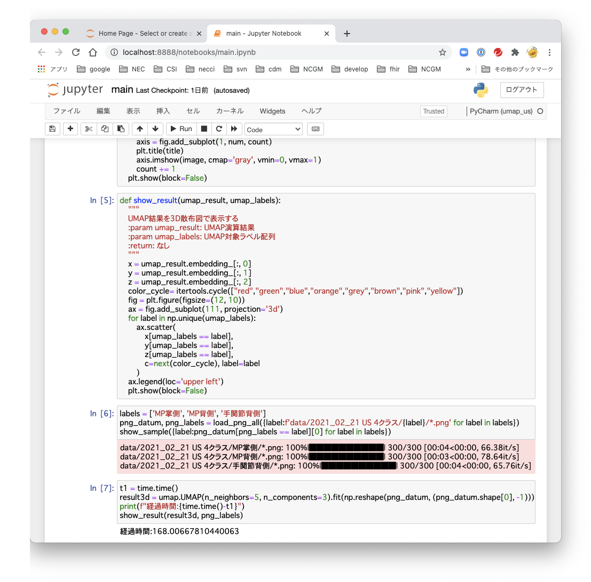
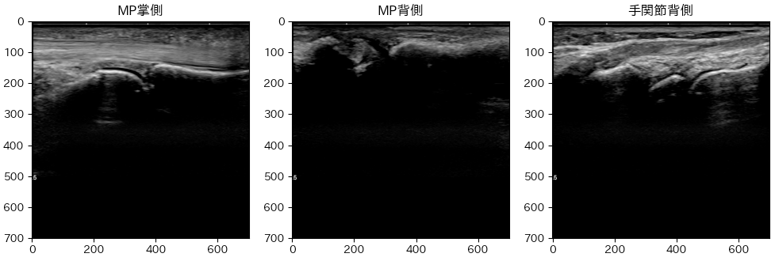
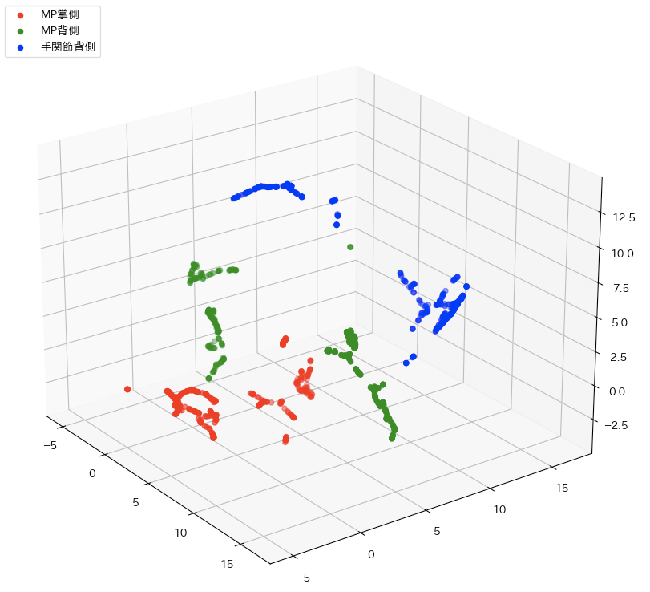

# 超音波画像クラスタリング

超音波画像をUMAPを用いて、教師なし学習を行う。

## 画像データ配置方法

``data/2021_02_21 US 4クラス`` フォルダに ``MP掌側`` ``MP背側`` ``手関節背側`` 
サブフォルダを作成し、その中に、pngファイルを配置する。


## 事前準備

### 前提条件

コンポーネント|バージョン
---|---
CPU|Intel Core i9 2.4GHz 8Core
GPU|利用せず
OS|macOS Big Sur 11.2.1
python|Python 3.8.8 Clang 12.0.0 on darwin
実行環境|PyCharm or VSCode or jupyter notebook

### anyenv導入

```zsh
cd
brew install anyenv
anyenv install --init
# Do you want to checkout ? [y/N]: y
echo 'eval "$(anyenv init -)"' >> ~/.zshrc
exec $SHELL -l
mkdir -p ~/.anyenv/plugins
git clone https://github.com/znz/anyenv-update.git ~/.anyenv/plugins/anyenv-update
git clone https://github.com/znz/anyenv-git.git ~/.anyenv/plugins/anyenv-git
```

### tcl/tk 8.6 導入

Big Surのtcl-tkがVer. 8.5であるため、8.6を導入する。
PATH, PYTHON_CONFIGURE_OPTSを設定しないとtcl8.6が利用されない。

```zsh
brew install tcl-tk
echo "export PATH='/usr/local/opt/tcl-tk/bin:$PATH'" >> ~/.zshrc
echo "export PYTHON_CONFIGURE_OPTS=\"--with-tcltk-includes='-I$(brew --prefix tcl-tk)/include' --with-tcltk-libs='-L$(brew --prefix tcl-tk)/lib -ltcl8.6 -ltk8.6'\"" >> ~/.zshrc
exec $SHELL -l
```

### pyenv導入

2021/3/3時点で、3.9系は機械学習系ライブラリが不十分であるため、3.8系を利用

```zsh
anyenv install pyenv
git clone https://github.com/pyenv/pyenv-virtualenv.git $(pyenv root)/plugins/pyenv-virtualenv
echo 'eval "$(pyenv virtualenv-init -)"' >> ~/.zshrc
exec $SHELL -l
pyenv install 3.8.8
```

## ソースの導入

### ソースの取得

```zsh
git clone https://github.com/yasushikobe/umap_us.git
```

## 仮想環境の作成

```zsh
cd umap_us
pyenv local 3.8.8
pyenv rehash
pyenv virtualenv umap_us
pyenv local umap_us
```

### 依存コンポーネントの導入

```zsh
pip install --upgrade pip setuptools
pip install jupyter
pip install -r requirements.txt
```

### jupyter token の固定化 （以前に実行している場合は不要）

```zsh
jupyter notebook --generate-config
sed -i.bak -e "s/# c.NotebookApp.token = '<generated>'/c.NotebookApp.token = '0000'/" ~/.jupyter/jupyter_notebook_config.py
```

## UMAPパラメータ

設定|設定値
---|---
入力画像次元|491401 (701px x 701px)
入力画像数|900 (300 x 3種)
UMAP次元|3次元
UMAP neighbors|5個

## 実行結果

### jupyter実行結果



### 入力画像サンプル



### 実行結果3D散布図


