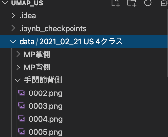
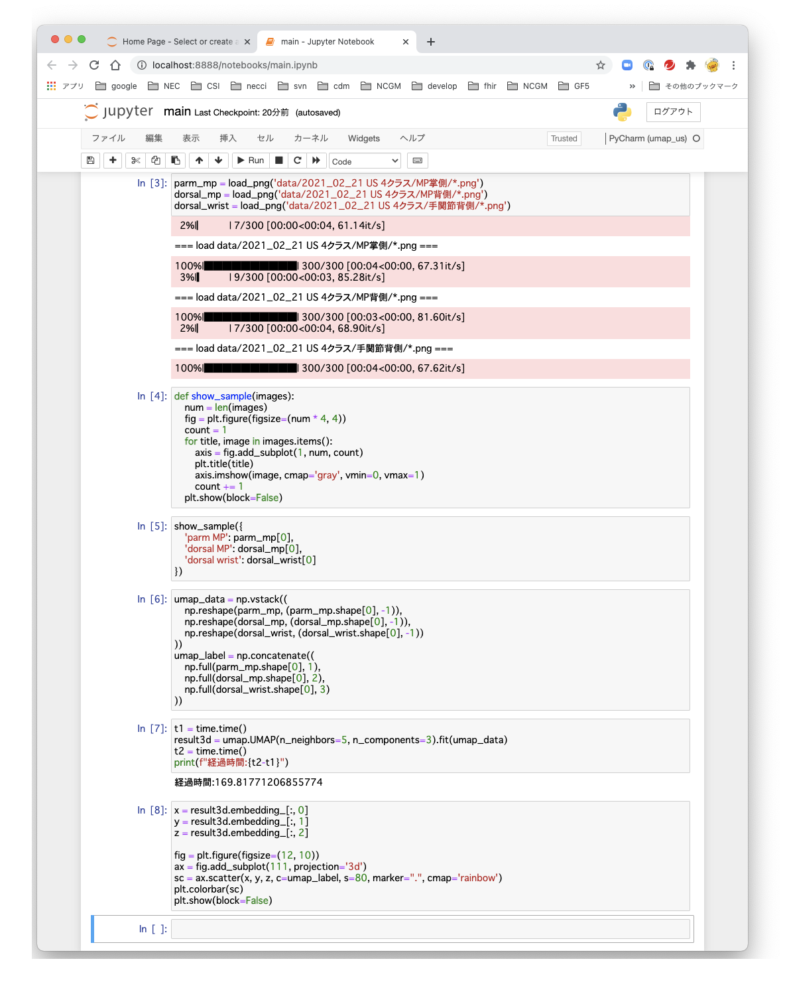
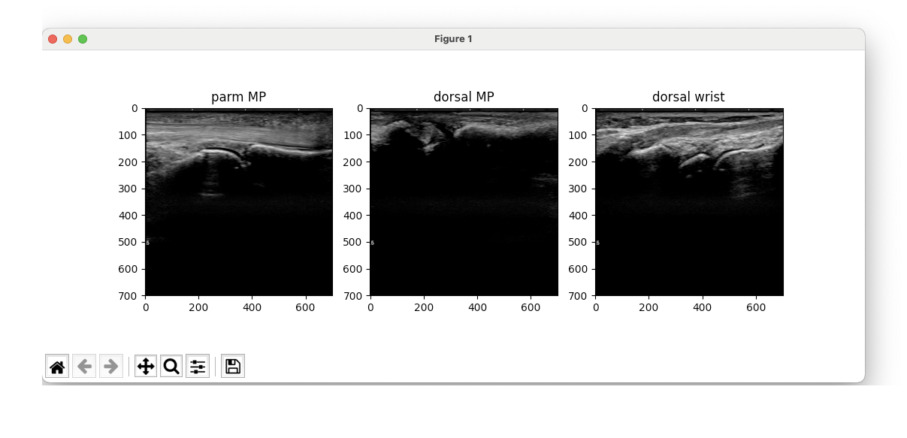
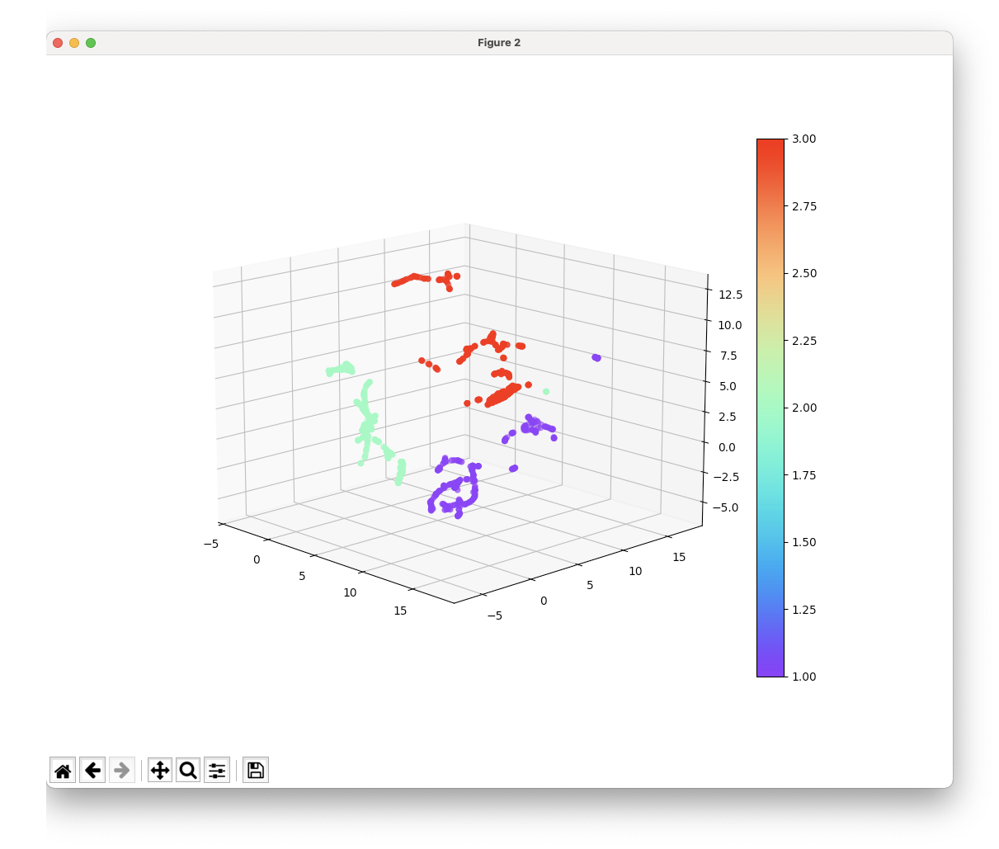

# 超音波画像クラスタリング

超音波画像をUMAPを用いて、教師なし学習を行う。

## 画像データ配置方法

``data/2021_02_21 US 4クラス`` フォルダに ``MP掌側`` ``MP背側`` ``手関節背側`` 
サブフォルダを作成し、その中に、pngファイルを配置する。



## 事前準備

> 必要に応じて、仮想環境を作成してください。

コンポーネント|バージョン
---|---
CPU|Intel Core i9 2.4GHz 8Core
GPU|利用せず
OS|macOS Big Sur 11.2.1
python|Python 3.8.8 Clang 12.0.0 on darwin
実行環境|PyCharm or VSCode or jupyter notebook

依存コンポーネントの導入し、``jupyter notebook``を起動する。

```zsh
pip install --upgrade pip
pip install jupyter
pip install -r requirements.txt
jupyter notebook
```

## UMAPパラメータ

設定|設定値
---|---
入力画像次元|491401 (701px x 701px)
入力画像数|900 (300 x 3種)
UMAP次元|3次元
UMAP neighbors|5個

## 実行結果

### jupyter実行結果



### 入力画像サンプル



### 実行結果3D散布図



## グラフ上の色と値について

色|値|内容
---|---|---
紫|1|MP掌側
薄緑|2|MP背側
橙|3|手関節背側
